# Adding / Managing Expenses

## Main Menu
The menu lets you navigate between adding or curation of existing entries. It additionally offers analytic insights which help to reflect on past spendings.
The application lets you also backup your spendings to .csv or .json into your iCloud account.
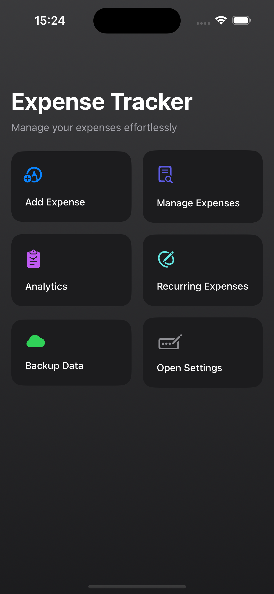
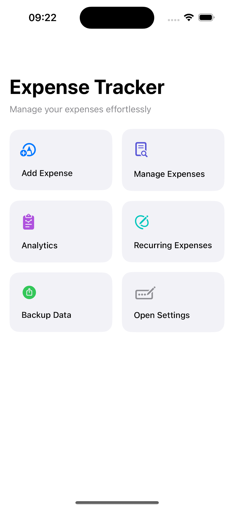

## Add Expenses
Adds one new spendings. The bottom area shows a list of previously added spendings. Input into the description field or selection of values in the dropdown filter the bottom list. If similar expenses occurred in the past, you can load them into the form by tapping on them to save the time to re-enter them.

### Vendor / Category
It is strongly recommended to use the dropdown options (it is possible to disable the necessity to populate them in the settings).
They provided valuable insights for your spending behavior. 
We do not pre-define any values for the expense category field. There is no general granularity of separating expenses which fits for everyone.
You are strongly encouraged to define categories which match your lifestyle and seem relevant for you to track.

The only pre-defined options that exist are for the expense type to provide a bird-view on your expenses.

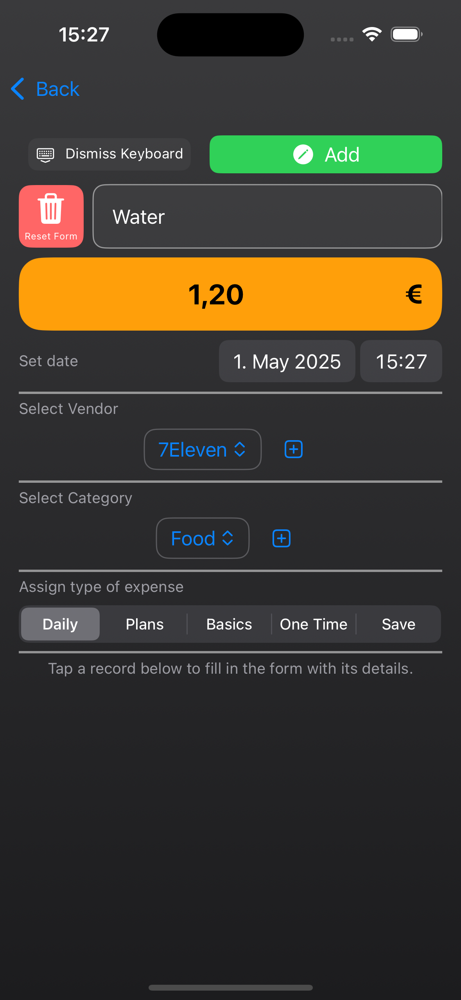
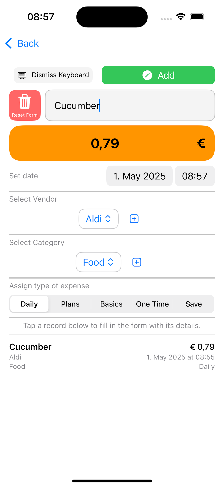

#### New dropdown options
Dropdown values for the fields vendor or categories are added by tapping the plus item and opening a free text input field.

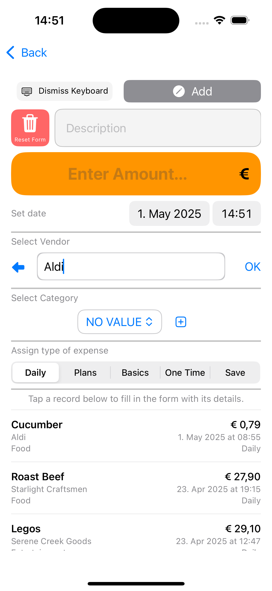

## Recurring monthly expenses
You can pre-define recurring expenses like rent, electricity payments, which are due every month but also lifestyle subscriptions or saving plans to avoid having to input them every month anew manually. By navigating the date wheel at the bottom you can select a target month into which the expenses are then written / registered on button click.

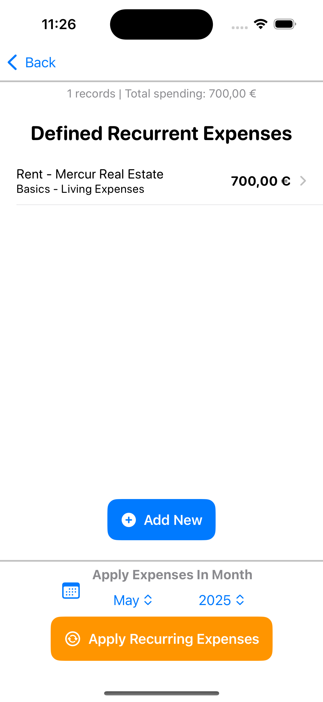

## Manage Expenses - Edit / Update / Delete
In Manage Expenses you can browse and limit existing records to modify and adjust them post-hoc. You may halso delete entries by left swiping on list rows.
The area is intended to correct input errors and remove wrongfully added records. (see analytic options below for exploration and analysis of spendings)

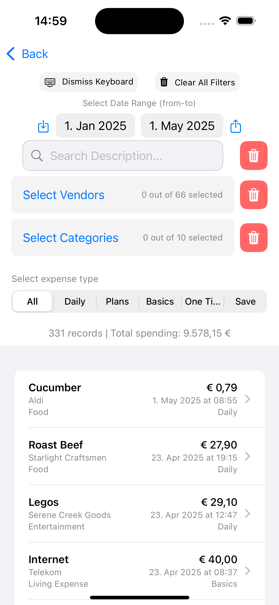

# Analytics
You may explore and visualize your spendings in a number of provided analysis features.

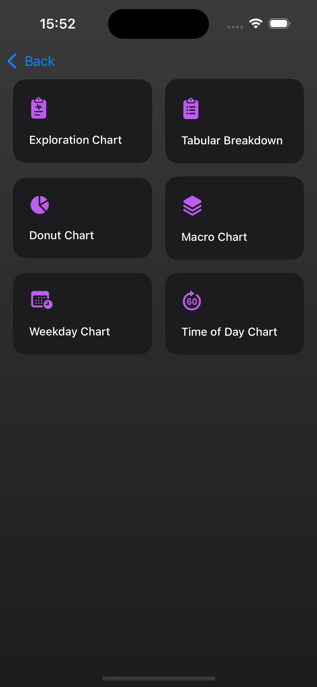

## Exploration Chart
This chart lets you freely sub-select and filter down by time, your defined dropdown categories and even on item description level and view the accumulated expenses for your selection criteria per month over the selected time range.

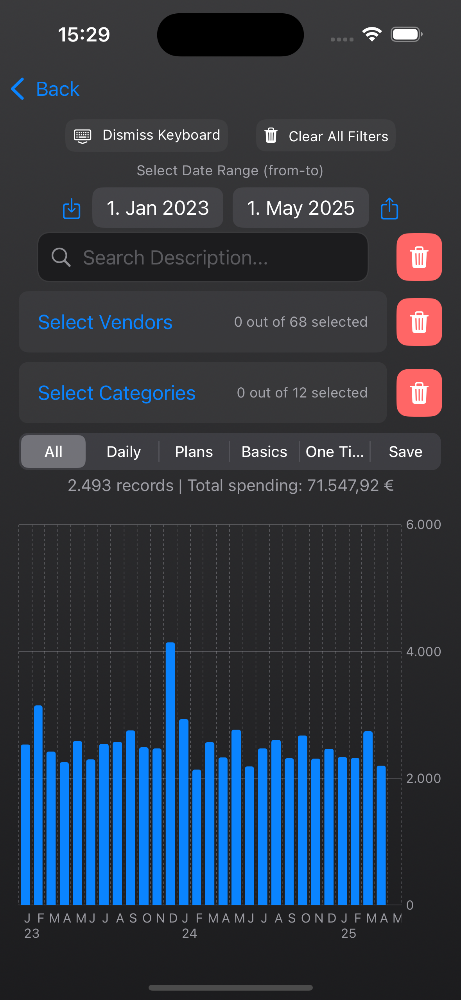
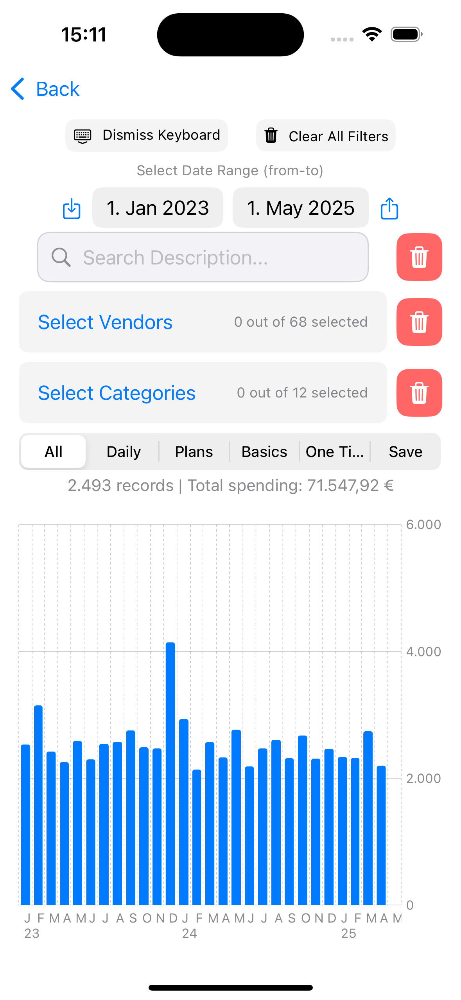

## Tabular Breakdown
The tabular breakdown uses a table structure over the vendor, expense category and expense type dimension summed-up to months, quarters, years and all time.
This presentation is much more dense and may simplify an analysis about your spending behaviors over time ranges and the money allocation per distinguished categories.

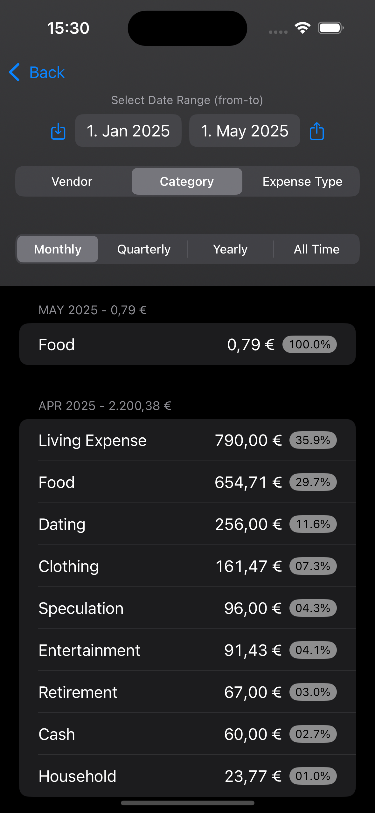
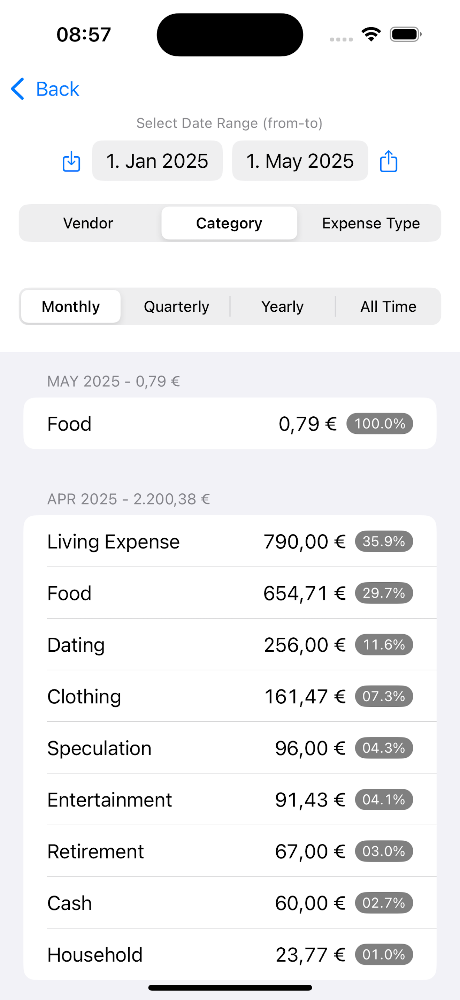

## Donut Chart
A lightly different visualization of the categorical values which may suite some uses better to understand their spending habits.

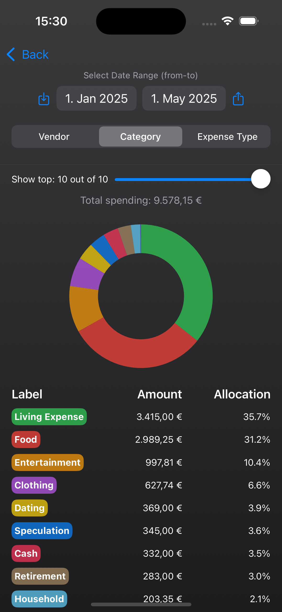
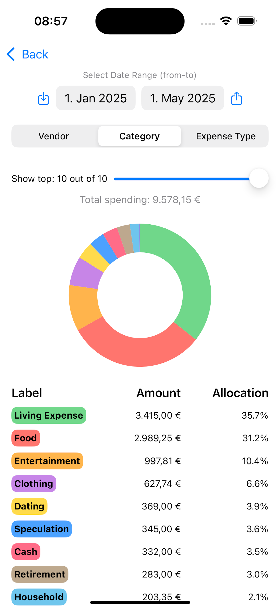

## Weekday / Hour Chart
A micro-view on the days in the week and the hour of day in which you spend your money. May help to clarify during which periods of the day you are most prone to (may unintentionally) spend your money.

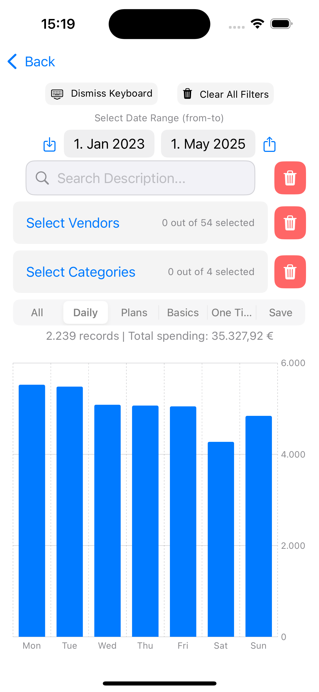
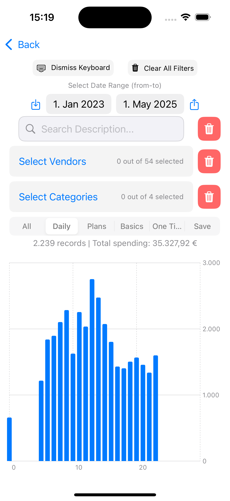

# Settings

You may customize and manage the stored data and dropdown selection values via the settings.

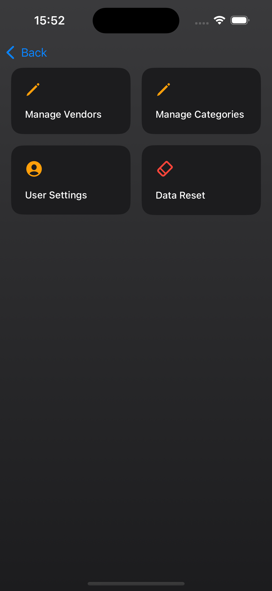
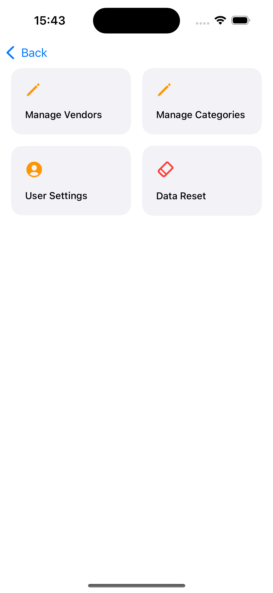

## Data Management

### Maintaining Dropdown Values
You may maintain the dropdown values via this option. If you feel the option list became too long and too many rarely used options are in the list you may remove them here (note: loading older spendings which uses any of the removed options will automatically add them back to the list)

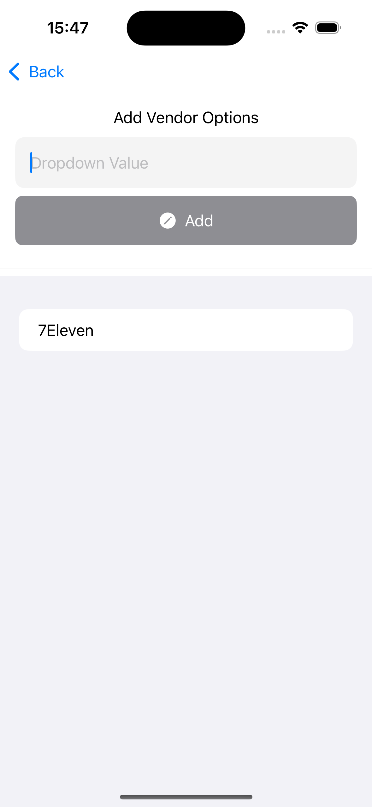
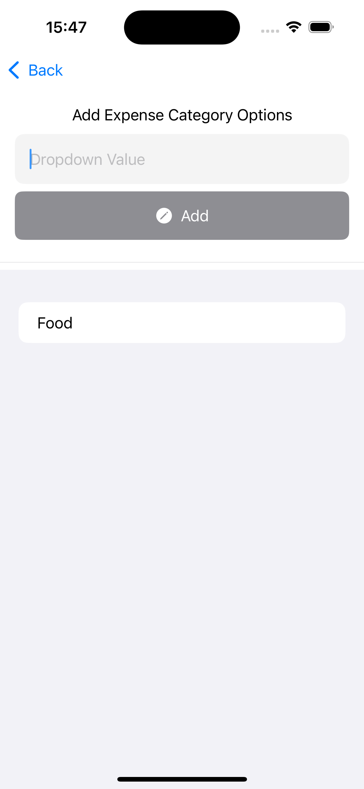

## Delete Data
You may remove all stored spendings you have stored but also all values in the dropdown values. This is a irreversable operation. Please be cautions.

# User Settings
You may set a custom currency symbol via the user settings. Additionally, while not recommended, you can disable the obligatory dropdown fields for vendor and category. If disabled, you may proceed in the add expense view without specifying any value for these fields. 

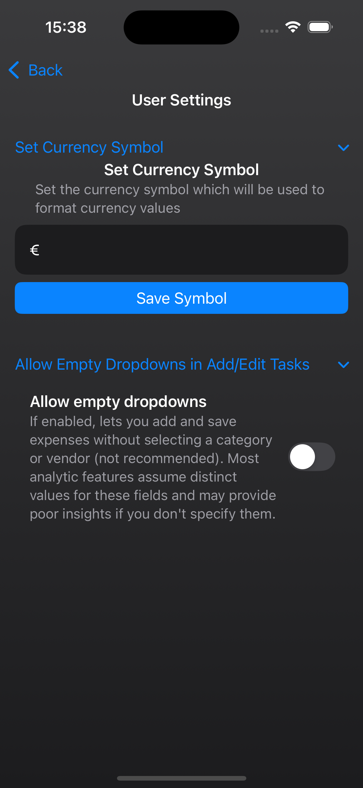
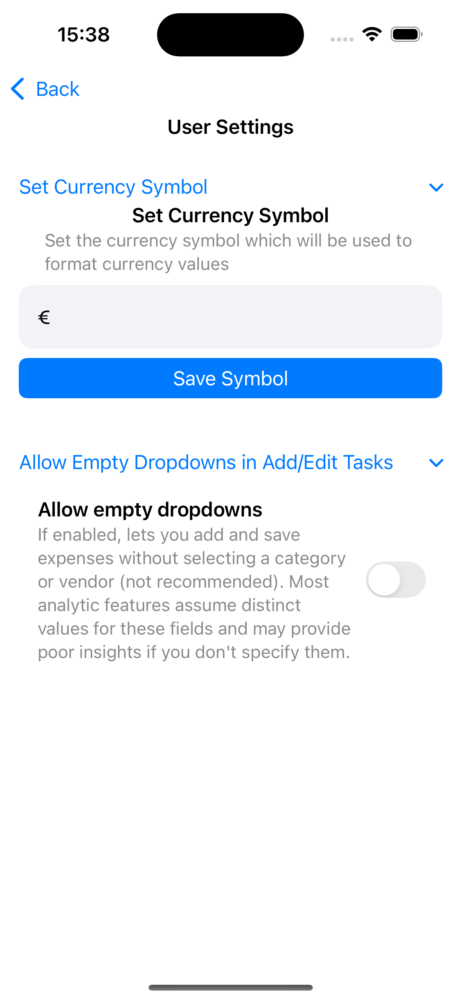

